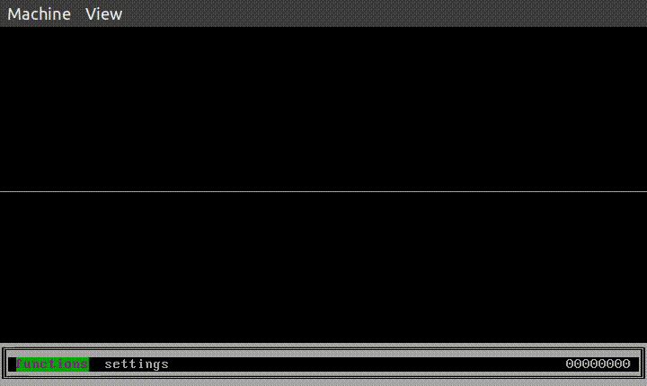
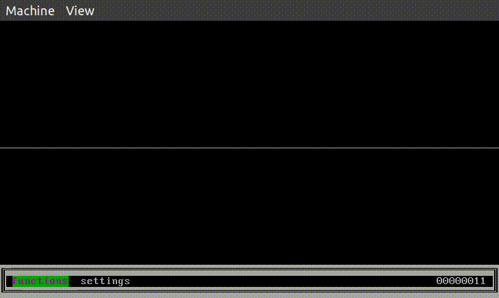

To start testing the various parts, follow the below steps:  
1. To start the shell, run the command `make qemu`  
2. Select **functions** option in the menu. 
3. This opens a bunch of options, select the **long** option.

This menu contains all the long computation functions implemented using coroutines, fibers, etc as required by the different parts of HoH lab 2.

# 2.1 
Select the **coroutine_fib** option. We have implemented Fibonacci function as the long computation function. It behaves as long computation function if given input of the order $10^9$, it takes about 15 seconds to compute the result and show the output. The answer is displayed mod $10^9+7$. When the function is running, the key press count is increased side by side as we press the key. Only one long computation task is handled at a time. So if we try to run another instance of coroutine during that time, it will not work.

# 2.2
Select the **fiber_fib** option. We have implemented Fibonacci function as the long computation function. It behaves as long computation function if given input of the order $10^9$, it takes about 15 seconds to compute the result and show the output. The answer is displayed mod $10^9+7$. When the function is running, the key press count is increased side by side as we press the key. Only one long computation task is handled at a time. So if we try to run another instance of fiber during that time, it will not work. But we can run fiber and co-routine side by side like all other functions.

  

# 2.3

We have made 2 functions for this, scheduler_fib and scheduler_hanoi. They are the fibonacci and Tower of Hanoi function respectively. The complexity of both the functions is exponential. Input of around 30 for fibonacci and 20 for Tower of Hanoi takes appx 20s for computation and displaying the result. We can run multiple instances of scheduler_fib at the same time and so is true for scheduler_hanoi also. We can also run multiple instances of scheduler_fib along with scheduler_hanoi. The key press counts are also updates simultaneously. 

  
